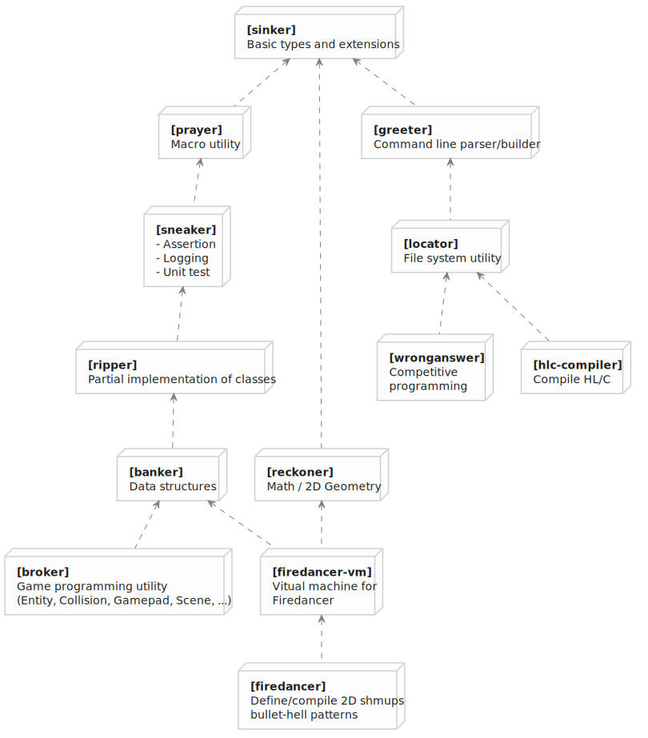

# FAL Haxe Libraries

## Overview

*This diagram shows only the nearest dependency relations.*  
*In fact, almost all libraries above directly depend on **sinker** library.*

## Basic Utilities

### [sinker](https://github.com/fal-works/sinker)

Core utility. Basic types and extensions.

### [locator](https://github.com/fal-works/locator)

File system utility.

## Advanced Utilities

### [prayer](https://github.com/fal-works/prayer)

Macro utility.

### [sneaker](https://github.com/fal-works/sneaker)

Assert, log and test.

### [ripper](https://github.com/fal-works/ripper)

Partial implementation of classes.

## Game Programming

### [banker](https://github.com/fal-works/banker)

Data structures intended for games.

### [broker](https://github.com/fal-works/broker)

Gaming utility.

## For Specific Purposes

### [wronganswer](https://github.com/fal-works/wronganswer)

Library for competitive programming.

### [hlc-compiler](https://github.com/fal-works/hlc-compiler)

Helps compile HashLink/C into executable.
